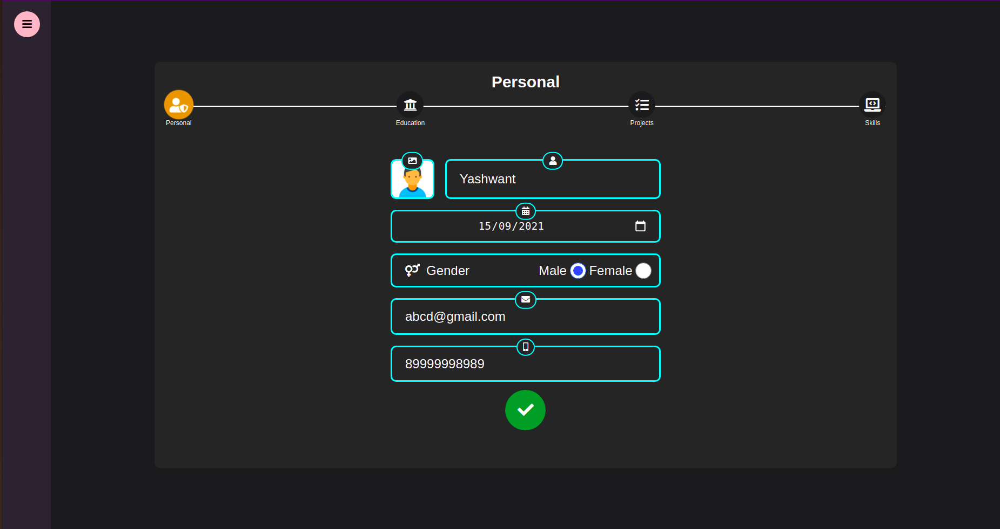
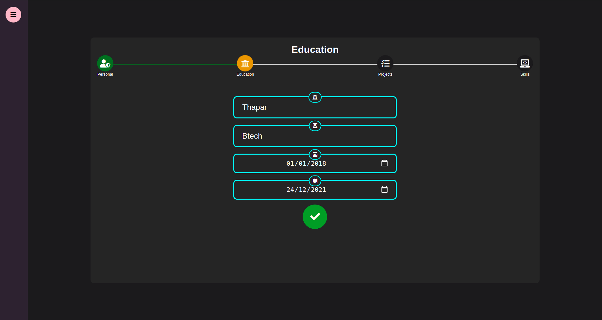
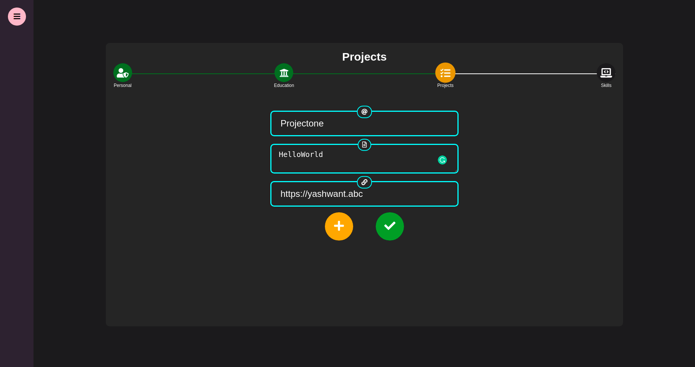
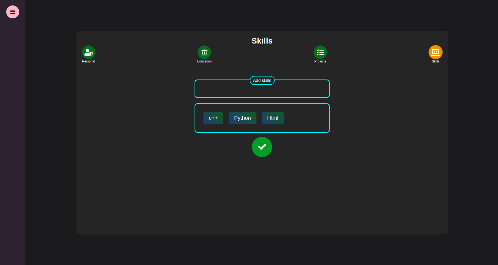
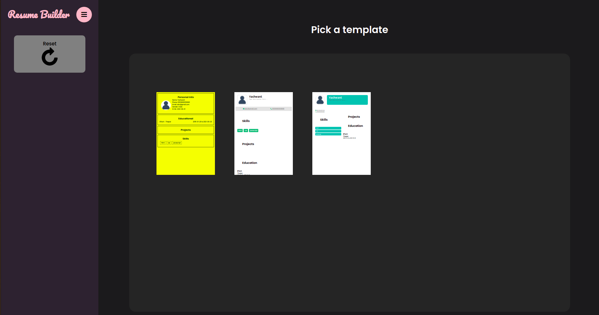

# Resume-Builder

<h1 align="center">
  <br>
  <a href=""></a>
  <br>
    Resume Builder
  <br>
</h1>

<h4 align="center">An opensource resume builder using React.js.</h4>
<br />







## 🚀Intro

Using a resume builder makes the process of creating a resume significantly faster and easier. Ever tried building your resume with Word?
The whole process is a huge pain – you make a TINY change to your resume, and the entire resume layout gets completely messed up.
With a resume builder, you don’t have to worry about the nitty gritty of resume creation, like font selection, layout, formatting, etc.
All you have to do is pick a resume template, fill it in, and then you’re ready to start applying for jobs!


## 🚀Getting Started

#### Clone the repo

```
git clone https://github.com/meyash/Vaartalaap.git
```

#### Install NPM packages

```
npm install
```

#### Start the react server

```
npm start
```

## 🚀Technologies Used

- [React.js](https://reactjs.org/)
- [Netlify](https://www.netlify.com/)


## 🚀License

[](/LICENSE)

By [Yashwant](https://github.com/meyash)

## 🚀Contributors

<br />

<a href="https://meyash.xyz/" style="margin-right:30px;"></a>
<a href="https://meyash.xyz/resume.pdf" style="margin-right:30px;"></a> 
<a href="https://www.linkedin.com/in/meyash21/" style="margin-right:30px;"></a>
<a href="https://twitter.com/meyash21" style="margin-right:30px;"></a>
<a href="https://www.codechef.com/users/meyash21" style="margin-right:30px;"></a>  
